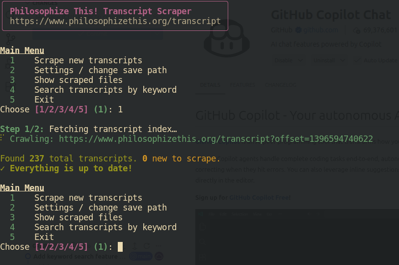
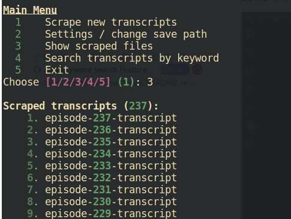
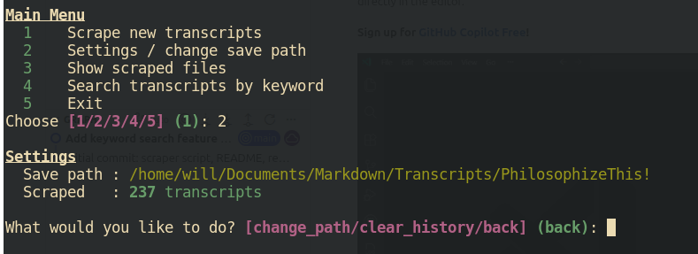

# 📻 Philosophize This! Transcript Scraper

A polished, TUI-driven Python scraper that downloads every transcript from [Philosophize This!](https://www.philosophizethis.org/transcript), converts them to clean Markdown files, and keeps itself up to date on every subsequent run — only ever fetching what's new.

[](https://buymeacoffee.com/succinctrecords)

---

## 📸 Screenshots

| Scraping in action | Keyword search results |
|---|---|
|  |  |

| Scraped files list | Settings menu |
|---|---|
|  |  |

---

## ✨ Features

- 🖥️ **Interactive TUI** — clean terminal menus powered by [Rich](https://github.com/Textualize/rich)
- 🔖 **Persistent config** — remembers your save path and scrape history across runs (`~/.philosophize_scraper.json`)
- ⚡ **Incremental scraping** — tracks what's already been downloaded and only fetches new transcripts
- 📄 **Markdown output** — one `.md` file per episode, HTML converted to clean Markdown with YAML frontmatter
- 📑 **Auto-pagination** — follows all *Older Posts* pages on the index automatically
- 🐢 **Polite by default** — 1.5s delay between requests and automatic retry with backoff
- 🛠️ **Settings menu** — change your save path or clear scrape history at any time

---

## 📋 Requirements

- Python **3.10+**
- Linux / macOS / WSL (developed & tested on **Linux Mint**)

---

## 🚀 Installation

**1. Clone the repository**

```bash
git clone https://github.com/WB2024/philosophize-scraper.git
cd philosophize-scraper
```

**2. Create a virtual environment** *(recommended)*

```bash
python3 -m venv .venv
source .venv/bin/activate
```

**3. Install dependencies**

```bash
pip install -r requirements.txt
```

---

## ▶️ Usage

```bash
python3 scrape_philosophize.py
```

### First run

On first launch you'll be greeted by the setup prompt:

```
╭─────────────────────────────────────────────────────╮
│   Philosophize This! Transcript Scraper              │
│   https://www.philosophizethis.org/transcript        │
╰─────────────────────────────────────────────────────╯

First run! Let's set up your save directory.

Enter the directory path to save transcripts [~/philosophize_transcripts]:
```

Enter your preferred path (or press Enter to accept the default). The directory will be created if it doesn't exist.

### Main menu


```
Main Menu
  1   Scrape new transcripts
  2   Settings / change save path
  3   Show scraped files
  4   Search transcripts by keyword
  5   Exit
```

| Option | Description |
|--------|-------------|
| **1** | Crawl the index, find new transcripts, download & convert them |
| **2** | Change save path or clear scrape history |
| **3** | List all previously scraped episode slugs |
| **4** | Search all scraped transcripts for a keyword |
| **5** | Exit the program |

---

## � Keyword Search

Option **4** in the main menu lets you search all previously scraped transcripts for any keyword or phrase.

1. Select **4 – Search transcripts by keyword** from the main menu
2. Enter a keyword (e.g. `Plato`, `stoicism`, `free will`)
3. Every `.md` file in your save directory is scanned for that term (case-insensitive)
4. Results are displayed in a table sorted by **mention count**, highest first:

```
'Plato' found in 12 transcript(s):

  #   Episode                                       Mentions
  1   episode-047-transcript                              38
  2   episode-012-transcript                              21
  ...
```

Episodes with zero mentions are excluded from the results.


---

## �📁 Output Format

Each transcript is saved as an individual Markdown file named after the episode slug:

```
~/philosophize_transcripts/
├── episode-001-transcript.md
├── episode-002-transcript.md
├── ...
└── episode-230-transcript.md
```

Every file includes a YAML frontmatter header followed by the full transcript in Markdown:

```markdown
---
title: "Episode 230 - ..."
slug: "episode-230-transcript"
source: "https://www.philosophizethis.org/transcript/episode-230-transcript"
scraped_at: "2026-04-02"
---

# Episode 230 - ...

Lorem ipsum transcript content...
```

---

## ⚙️ Configuration

Config is stored at `~/.philosophize_scraper.json` and is managed automatically by the TUI. You can also inspect or edit it directly:

```json
{
  "save_path": "/home/youruser/philosophize_transcripts",
  "scraped": [
    "episode-001-transcript",
    "episode-002-transcript",
    "..."
  ]
}
```

| Key | Description |
|-----|-------------|
| `save_path` | Absolute path where `.md` files are written |
| `scraped` | List of episode slugs already downloaded — used to skip on future runs |

To force a full re-scrape, either delete this file or use **Settings → Clear scrape history** from within the TUI.


---

## 🧰 Tech Stack

| Library | Purpose |
|---------|---------|
| [`requests`](https://docs.python-requests.org/) | HTTP requests |
| [`beautifulsoup4`](https://www.crummy.com/software/BeautifulSoup/) | HTML parsing |
| [`markdownify`](https://github.com/matthewwithanm/python-markdownify) | HTML → Markdown conversion |
| [`rich`](https://github.com/Textualize/rich) | TUI, progress bars, styled output |

> **Why not Scrapy?**  
> Scrapy is a powerful framework but overkill for this task. The Philosophize This! website is server-rendered HTML with no JavaScript rendering required, so `requests` + `BeautifulSoup` is simpler, more readable, and easier to maintain.

---

## 🤝 Permissions & Ethics

Transcripts are scraped with the **explicit permission of the author**. Please:

- Do **not** redistribute the scraped content publicly without permission
- Keep the built-in request delay in place to avoid hammering the server
- Use the content for **personal, educational use**

---

## 🐛 Troubleshooting

**`ModuleNotFoundError`** — make sure your virtual environment is activated:
```bash
source .venv/bin/activate
```

**A transcript shows no content** — the script will warn you and skip it. This usually means the page structure was different for that episode. You can manually check the URL printed in the warning.

**Interrupted mid-run** — no problem. Progress is saved to the config file after *each successful file*, so just re-run and it will pick up where it left off.

---

## ☕ Support

If you find this useful, consider buying me a coffee!

[](https://buymeacoffee.com/succinctrecords)

---

## 📜 License

This project is for personal use. The transcript content belongs to the creator of [Philosophize This!](https://www.philosophizethis.org). The scraper code itself is released under the [MIT License](LICENSE).
